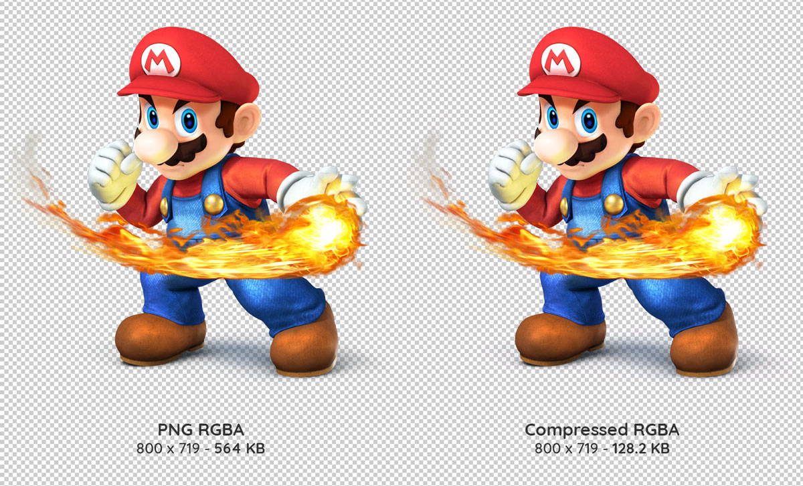
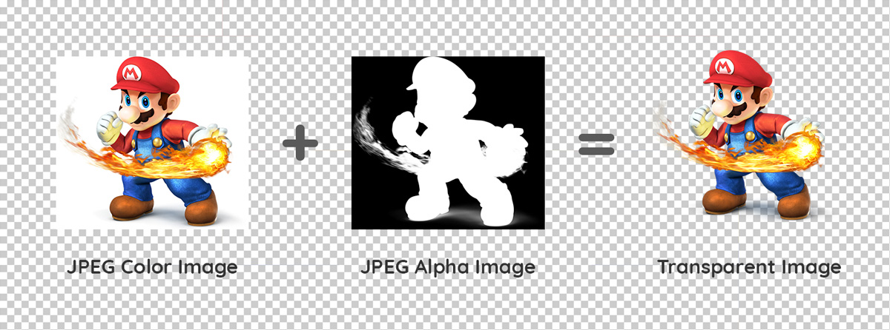

# imgAlpha.js

**imgAlpha.js** is a jQuery plugin by Yann Masoch allowing to use light-weight transparent images on any website.



Suggestion are more than welcome, not only for feature requests but also for coding style improvements.


## How it Works
**imgAlpha.js** uses 2 compressed images such as jpeg format to build a light-weight transparent image. No more ugly GIF and no more heavy PNG!!

Simply save your image in 2 regular jpeg files:
1. The color image (by default the background color is a plain white - #FFFFFF)
2. The alpha image (black is transparent and white is opaque)



## Installation
Download package and include `jquery.imgAlpha.min.js` in your document after including jQuery.

#### Html
```html
<script type="text/javascript" src="/path/to/jquery.min.js"></script>
<script type="text/javascript" src="/path/to/jquery.imgAlpha.min.js"></script>
```

#### NPM
```sh
npm install imgalpha.js
```

#### CDN
*Coming soon!*

## Usage

#### Plugin Initialization
All you need to do is call imgAlpha.js inside a `$(document).ready` function:

for all `` elements:
```javascript
$(document).ready(function() {
    $("img").imgAlpha();
});
```

or for a specific `` element:
```javascript
$(document).ready(function() {
    $("#myImg").imgAlpha();
});
```

#### Javascript Options
A Javascript configuration with options looks like this:
```javascript
$(document).ready(function() {
    $("#myImg").imgAlpha({
        imgColor: "/path/to/my-image-color.jpg",
        imgAlpha: "/path/to/my-image-alpha.jpg",
        bgColor: "#FFFFFF"
    });
});
```

#### Html Options
An Html configuration with options looks like this:
```html

```


## Options

Option | Type | Default | Description
------ | ---- | ------- | -----------
imgColor | string | null | Color image URL
imgAlpha | string | null | Alpha image URL
bgColor | string (hex value) | `#ffffff` | Background plain color used in the color image

#### imgColor
The `imgColor` or `data-img-color` define the color image.

By default the the color image is `null` and the color image used will be the one provided in the `src` attribute of the `` element.


#### imgAlpha
The `imgAlpha` or `data-img-alpha`define alpha image used to make the color image transparent.

By default the alpha image is `null` and the image transparency processing will be skipped.

#### bgColor
The `bgColor` or `data-bg-color` define the background plain color used in the color image.

By default the background color is white `#ffffff` and if the provided string is not a correct hex value it will be replaced by the default value.

This option accepts hex values with and without the `#` such as `#a9dbed` or `a9dbed`.


## License

MIT License

Copyright (c) 2017 Yann Masoch

Permission is hereby granted, free of charge, to any person obtaining a copy
of this software and associated documentation files (the "Software"), to deal
in the Software without restriction, including without limitation the rights
to use, copy, modify, merge, publish, distribute, sublicense, and/or sell
copies of the Software, and to permit persons to whom the Software is
furnished to do so, subject to the following conditions:

The above copyright notice and this permission notice shall be included in all
copies or substantial portions of the Software.

THE SOFTWARE IS PROVIDED "AS IS", WITHOUT WARRANTY OF ANY KIND, EXPRESS OR
IMPLIED, INCLUDING BUT NOT LIMITED TO THE WARRANTIES OF MERCHANTABILITY,
FITNESS FOR A PARTICULAR PURPOSE AND NONINFRINGEMENT. IN NO EVENT SHALL THE
AUTHORS OR COPYRIGHT HOLDERS BE LIABLE FOR ANY CLAIM, DAMAGES OR OTHER
LIABILITY, WHETHER IN AN ACTION OF CONTRACT, TORT OR OTHERWISE, ARISING FROM,
OUT OF OR IN CONNECTION WITH THE SOFTWARE OR THE USE OR OTHER DEALINGS IN THE
SOFTWARE.